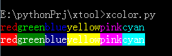
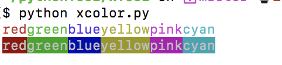
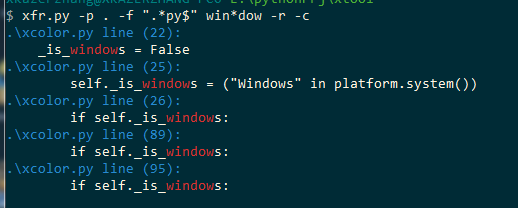

## Python Tools


### xcolor
print color text, support Windows/Mac/Linux
```
    Color.setColor(Color.RED)
    Color.println("red")
    Color.setColor(Color.GREEN)
    Color.println("green")
    Color.setColor(Color.BLUE)
    Color.println("blue")
    Color.setColor(Color.YELLOW)
    Color.println("yellow")
    Color.setColor(Color.PINK)
    Color.println("pink")
    Color.setColor(Color.CYAN)
    Color.println("cyan")
    Color.resetColor()
    print

    Color.setColor(Color.WHITE, Color.RED)
    Color.println("red")
    Color.setColor(Color.WHITE, Color.GREEN)
    Color.println("green")
    Color.setColor(Color.WHITE, Color.BLUE)
    Color.println("blue")
    Color.setColor(Color.WHITE, Color.YELLOW)
    Color.println("yellow")
    Color.setColor(Color.WHITE, Color.PINK)
    Color.println("pink")
    Color.setColor(Color.WHITE, Color.CYAN)
    Color.println("cyan")
    Color.resetColor()
    print
```
- Windows:



- Mac:




### xfr
search string from test,support regex

Usage: xfr.py [options] str

Options:
  -h, --help            show this help message and exit
  -f FILTER, --filter=FILTER
                        filter for filename(regex)
  -p PATH, --path=PATH  set work path
  -r, --regex
  -c, --color
  -v, --verbose
```
xfr.py -p . -f ".*py$" win*dow -r -c
```


